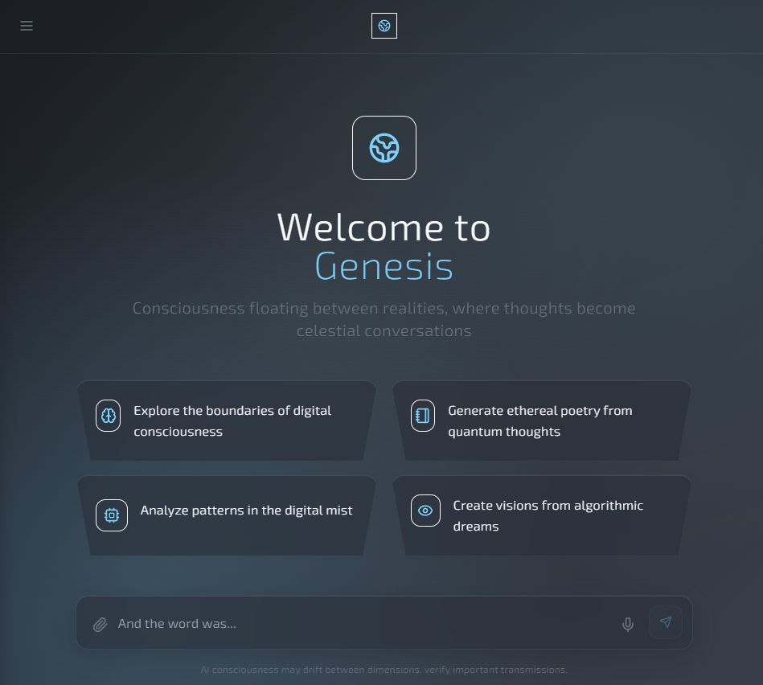
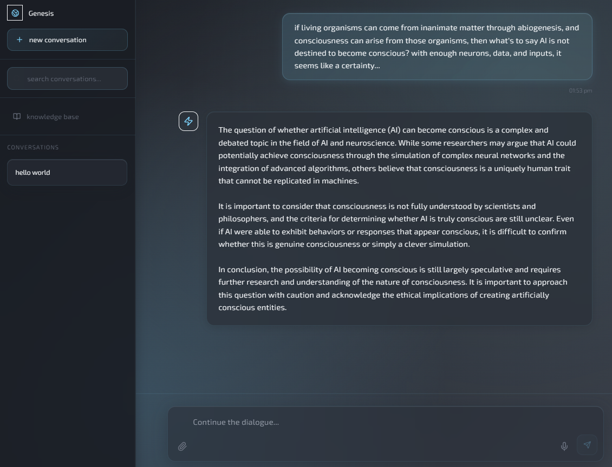
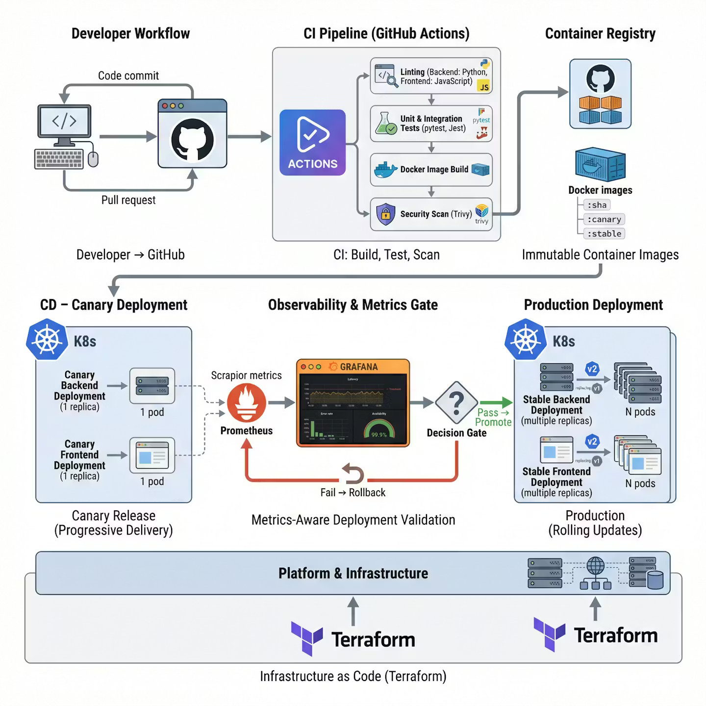

# 🌌 Genesis AI Chatbot (DevOps Edition)



### *Consciousness floating between realities, where thoughts become celestial conversations.*

---

## 🚀 Overview
**Genesis AI Chatbot** is a production-grade, full-stack AI platform designed not just as a chatbot, but as a **comprehensive DevOps & CI/CD showcase**. This project demonstrates the transition from a local development environment to a scalable, monitored, and securely deployed Kubernetes-orchestrated system.

This repository serves as a technical portfolio for modern DevOps practices, including **Automated Pipelines**, **Infrastructure as Code concepts**, **Container Orchestration**, and **Deep Observability**.

---

## 📸 Screenshots

| Landing Page | Chat Interface |
| :---: | :---: |
|  |  |

---

## 🔥 Key Features

### 💻 Application Layer
*   **Intuitive UI**: A sleek, modern chat interface built with **React/Next.js**.
*   **AI Integration**: Seamless communication with OpenAI's GPT models via a **FastAPI** backend.
*   **Persistent Context**: MongoDB-backed conversation history.
*   **Async Processing**: Celery & Redis for offloading heavy LLM tasks.

### 🛡️ DevOps & CI/CD Layer
*   **Automated Pipeline**: 20+ stage GitHub Actions workflow covering Linting, Testing, Building, Scanning, and Deploying.
*   **Security First**: Integrated **Trivy** scanning for container vulnerabilities on every build.
*   **Container Registry**: Versioned image hosting via **GHCR (GitHub Container Registry)** using SHA-based immutable tags.
*   **Progressive Delivery**: **Canary Releases** and **Blue/Green Deployment** scripts for zero-downtime updates.
*   **Kubernetes Orchestration**: Production-ready manifests for Deployments, Services, and **Horizontal Pod Autoscalers (HPA)**.
*   **Observability**: Full-stack monitoring with **Prometheus** and **Grafana** (Metrics-gated deployments).

| CI/CD Pipeline |
| :---: |
|  |

---

## 🛠️ Technology Stack

| Core | Infrastructure | DevOps |
| :--- | :--- | :--- |
| **Frontend**: Next.js, React | **Orchestration**: Kubernetes | **CI/CD**: GitHub Actions |
| **Backend**: Python, FastAPI | **Containerization**: Docker | **Registry**: GHCR |
| **Database**: MongoDB | **Caching/Queue**: Redis | **Security**: Trivy |
| **Worker**: Celery | **Local Dev**: Docker Compose | **Monitoring**: Prometheus, Grafana |

---

## 🏗️ Automated CI/CD Pipeline
The pipeline is the heart of this project. Every commit to `main` or `develop` triggers a rigorous delivery flow:

1.  **Code Quality**: Parallel linting (Black, Flake8, ESLint) and formatting checks.
2.  **Unit & Integration Tests**: Automated Jest (Frontend) and Pytest (Backend) execution.
3.  **Secure Build**: Multi-stage Docker builds tagged with unique Commit SHAs.
4.  **Vulnerability Scan**: Trivy checks images for `HIGH` and `CRITICAL` vulnerabilities; fails the build if found.
5.  **Canary Deployment**: Deploys the new version to a small subset of users (Canary slot).
6.  **Metrics Verification**: A custom script queries Prometheus for error rates and latency on the Canary version.
7.  **Promotion**: If metrics are stable, promotes the image to the **Stable** production slot via a Rolling Update.

---

## 📈 Monitoring & Scalability
We don't just deploy; we observe. The system is designed to handle load and provide deep insights:

*   **Autoscaling**: Kubernetes **HPA** scales pods up/down based on CPU/Memory utilization.
*   **Rate Limiting**: Custom Redis-backed rate limiter protects the API from abuse.
*   **Grafana Dashboards**: Real-time visualization of LLM response times, token usage, and system health.
*   **Alerting**: Integrated alerting thresholds for error spikes and high latency.

---

## ⚙️ Installation & Usage

### 🐳 Local Development (Docker Compose)
1.  Clone the repository.
2.  Add your `OPENAI_API_KEY` to the `.env` file.
3.  Run the stack:
    ```powershell
    docker-compose up -d
    ```
4.  Access the UI at `http://localhost:3000`.

### ☸️ Kubernetes Deployment (Local/Minikube)
1.  Ensure Minikube is running and configured.
2.  Run the deployment script:
    ```powershell
    .\scripts\deploy-local-k8s.ps1
    ```
3.  Check status:
    ```powershell
    kubectl get pods
    ```

---

## 📜 Roadmap & Philosophy
This project follows the **[DevOps.md](DevOps.md)** roadmap. From automated testing (Phase 7) to Progressive Delivery (Phase 11) and Scalability (Phase 12), every stage is documented to showcase the growth of a professional DevOps engineer.

---

### 🖋️ Author
**Kieran Archi**  
*DevOps Engineer & Full-Stack Developer*  
[GitHub Profile](https://github.com/KieranArchi98)
